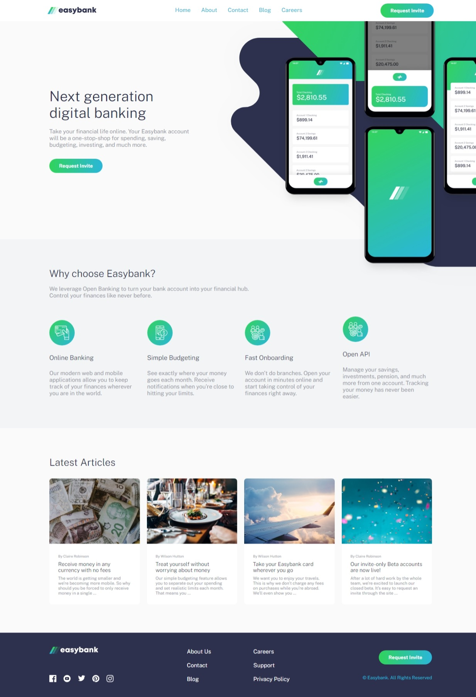
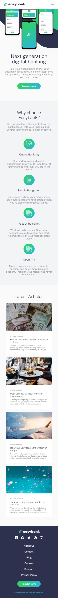

# Frontend Mentor - Easybank landing page solution

This is a solution to the [Easybank landing page challenge on Frontend Mentor](https://www.frontendmentor.io/challenges/easybank-landing-page-WaUhkoDN). Frontend Mentor challenges help you improve your coding skills by building realistic projects. 

## Table of contents

- [Overview](#overview)
  - [The challenge](#the-challenge)
  - [Screenshot](#screenshot)
  - [Links](#links)
- [Built with](#built-with)
- [Author](#author)

## Overview

### The challenge

Users should be able to:

- View the optimal layout for the site depending on their device's screen size
- See hover states for all interactive elements on the page

### Screenshot

### Links

- [Solution](https://www.frontendmentor.io/solutions/easybank-landing-page-master-with-css-html-and-javascript-CtyudX5vEq)
- [Live site](https://alex1999-03.github.io/easybank-landing-page-master)

## Built with

- Semantic HTML5 markup
- CSS custom properties
- Flexbox
- Mobile-first workflow
- Grid CSS

## Author

- [Github](https://github.com/Alex1999-03)
- [Frontend Mentor](https://www.frontendmentor.io/profile/Alex1999-03)
